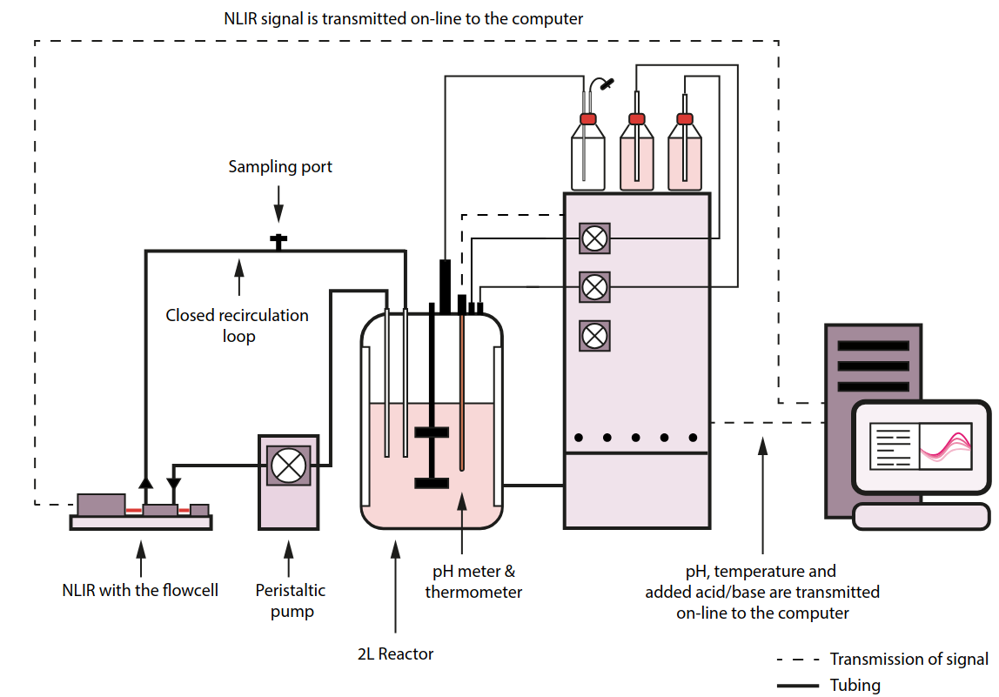

# 🚀 Discover Our Unique Datasets 📊

Welcome to the world of data exploration! Our ```chemotools``` package offers a treasure trove of datasets that will not only help you test the package but also serve as an exciting playground for your learning journey. These captivating datasets are tucked away in the ```chemotools.datasets``` module and can be easily unleashed using loading functions. Let's dive into the adventure:

- 🍷 **The [Fermentation Dataset: A Journey into Biochemistry](#🍷-the-fermentation-dataset-a-journey-into-biochemistry-🧪)**: Immerse yourself in the world of fermentation with this dataset containing mesmerizing spectra collected during a unique fermentation process.

- ☕ **The [the Coffee Dataset: A Global Coffee Journey](#☕-the-coffee-dataset-a-global-coffee-journey-🌍)**: Savor the flavors of the world with this dataset, featuring spectra from diverse coffee samples sourced from different countries.

## 🍷 The Fermentation Dataset: A Journey into Biochemistry 🧪

The Fermentation Dataset takes you on a thrilling ride through the art of fermentation. These spectra were meticulously gathered using attenuated total reflectance Fourier transform infrared spectroscopy (ATR-FTIR). The dataset comprises two sets of spectra: a training set and a test set. Take a peek at the enchanting fermentation setup in the image below:



For those curious minds, you can find more about the Fermentation Dataset in these fascinating publications:

- Cabaneros Lopez, P., Abeykoon Udugama, I., Thomsen, S.T., et al. 📘 [Transforming data to information: A parallel hybrid model for real-time state estimation in lignocellulosic ethanol fermentation](https://doi.org/10.1002/bit.27586).

- Cabaneros Lopez, P., Abeykoon Udugama, I., Thomsen, S.T., et al. 📙 [Towards a digital twin: a hybrid data-driven and mechanistic digital shadow to forecast the evolution of lignocellulosic fermentation](https://doi.org/10.1002/bbb.2108).

- Cabaneros Lopez, P., Abeykoon Udugama, I., Thomsen, S.T., et al. 📗 [Promoting the co-utilisation of glucose and xylose in lignocellulosic ethanol fermentations using a data-driven feed-back controller](https://doi.org/10.1186/s13068-020-01829-2).

#### 📚 THE TRAIN SET: Start Your Training Adventure

The train set boasts 21 synthetic spectra paired with their reference glucose concentrations, measured by high-performance liquid chromatography (HPLC). Ready to embark on your training journey? You can load the train set with a single command:

```python
from chemotools.datasets import load_fermentation_train

X_train, y_train = load_fermentation_train()
```

: .note}
> Want to master the art of building a PLS model using the Fermentation Dataset? 📝 [Dive into our Training Guide](https://paucablop.github.io/chemotools/get-started/brewing_regressor.html).

#### __🧪 THE TEST SET: Real-Time Exploration___

The test set takes you on a real-time adventure with over 1000 spectra collected during a fermentation process. These spectra are captured every 1.25 minutes over several hours. Moreover, you have 35 reference glucose concentrations, measured hourly during the fermentation, to gauge your model's performance.

Ready for this real-time exploration? Load the test set like a pro:

```python
from chemotools.datasets import load_fermentation_test

X_test, y_test = load_fermentation_test()
```

## __☕ The Coffee Dataset: A Global Coffee Journey 🌍__

The Coffee Dataset invites you to embark on a journey through the world of coffee. These captivating spectra are collected from a rich diversity of coffee samples, each originating from a different country. The magic happens with attenuated total reflectance Fourier transform infrared spectroscopy (ATR-FTIR).

Feeling the coffee buzz? You can load the Coffee Dataset with ease:

```python
from chemotools.datasets import load_coffee

spectra, labels = load_coffee()
```

{: .note}
> Ready to brew up some knowledge and build a PLS-DA classification model using the Coffee Dataset? 📚 [Get started with our Training Guide.](https://paucablop.github.io/chemotools/get-started/coffee_spectra_classifier.html)

Get ready to embark on an exhilarating data journey with our fascinating datasets. Happy exploring! 🌟🔍🚀