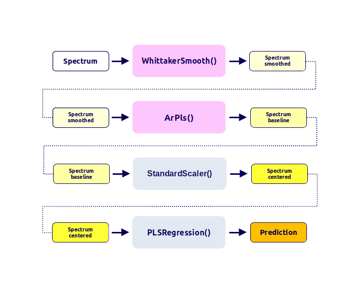
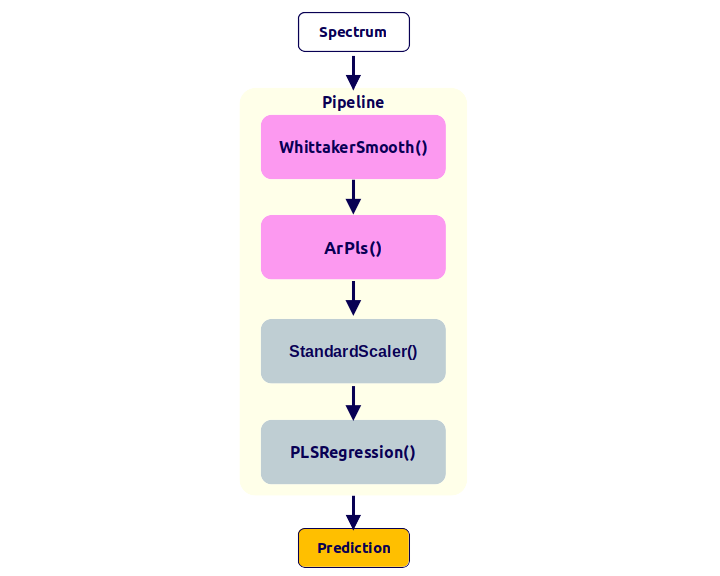

# __Scikit-learn integration__

This page shows how to use ```chemotools``` in combination with ```scikit-learn```. The following topics are covered:

- [Working with single spectra](#working-with-single-spectra)
- [Working with pipelines](#working-with-pipelines)
- [Working with pandas DataFrames](#working-with-pandas-dataframes)
- [Persisting your models](#persisting-your-models)

## __Working with single spectra__
Preprocessing techniques in ```scikit-learn``` are primarily designed to work with 2D arrays, where each row represents a sample and each column represents a feature (i.e., matrices). However, in spectroscopy, single spectra are often of interest, which are represented as 1D arrays (i.e., vectors). Below there is an example of a single spectrum:

```bash
array([0.484434, 0.485629, 0.488754, 0.491942, 0.489923, 0.492869,
        0.497285, 0.501567, 0.500027, 0.50265 ])
```

To apply ```scikit-learn``` and ```chemotools``` techniques to single spectra, they need to be reshaped into 2D arrays (i.e., a matrix with one row). To achieve this, you can use the following code that reshapes a 1D array into a 2D array with a single row:

```python
import numpy as np
from chemotools.scatter import MultiplicativeScatterCorrection

msc = MultiplicativeScatterCorrection()
spectra_msc = msc.fit_transform(spectra.reshape(1, -1))
```
The ```.reshape(1, -1)``` method is applied to the 1D array ```spectra```, which is converted into a 2D array with a single row. An example of the output of the ```.reshape(1, -1)``` method is shown below:

```bash
array([[0.484434, 0.485629, 0.488754, 0.491942, 0.489923, 0.492869,
         0.497285, 0.501567, 0.500027, 0.50265 ]])
```

{: .highlight }
> The output of the ```.reshape(1, -1)``` method is a 2D array with a single row. This is the format that ```scikit-learn``` and ```chemotools``` preprocessing techniques expect as input.

## __Working with pipelines__
Pipelines are becoming increasingly popular in machine learning workflows. In essence, pipelines are a sequence of connected data processing steps, where the output of one step is the input of the next. They are very useful for:

- automating complex workflows, 
- improving efficiency, 
- reducing errors in data processing and analysis and
- simplifying model persistence and deployment.

All preprocessing techniques in ```chemotools``` are compatible with ```scikit-learn``` and can be used in pipelines. As an example, we will study the case where we would like to apply the following preprocessing techniques to our spectra:

- Whittaker smoothing
- ArPls baseline correction
- Mean centering
- PLS regression

In a traditional workflow, would apply each preprocessing technique individually to the spectra as shown in the image below:

[](figures/no-pipeline.png)

The code to perform this workflow would look like this:

```python
form sklearn.cross_decomposition import PLSRegression
from sklearn.preprocessing import StandardScaler

from chemotools.baseline import ArPls
from chemotools.smooth import WhittakerSmooth

# Whittaker smoothing
spectra_smoothed = WhittakerSmooth().fit_transform(spectra)

# ArPls baseline correction
spectra_corrected = ArPls().fit_transform(spectra_smoothed)

# Mean centering
spectra_centered = StandardScaler(with_mean=True, with_std=False).fit_transform(spectra_corrected)

# PLS regression
pls = PLSRegression(n_components=2)
pls.fit(spectra_centered, reference)
prediction = pls.predict(spectra_centered)
```

This is a tedious and error-prone workflow, especially when the number of preprocessing steps increases. In addition, persisting the model and deploying it to a production environment is not straightforward, as each preprocessing step needs to be persisted and deployed individually.

A better approach is to use a pipeline, which automates the workflow and reduces the risk of errors. The figure below shows the same workflow as above, but using a pipeline:

[](figures/pipeline.png)

The code to perform this workflow would look like this:

```python
from sklearn.cross_decomposition import PLSRegression
from sklearn.pipeline import make_pipeline
from sklearn.preprocessing import StandardScaler

from chemotools.baseline import ArPls
from chemotools.smooth import WhittakerSmooth

pipeline = make_pipeline(
    WhittakerSmooth(),
    ArPls(),
    StandardScaler(with_std=False),
    PLSRegression(n_components=2)
)
```
Now the pipeline can be visualized, which will show the sequence of preprocessing techniques that will be applied in the pipeline and their parameters:

<iframe src="figures/pipeline_visual.html" width="100%" style="border: none;"></iframe>

Once the pipeline is created, it can be used to fit and transform the spectra and to make predictions:

```python
spectra_transformed = pipeline.fit(spectra, reference).predict(spectra)
```

The preprocessed spectra produced by the previous pipeline is shown in the figure below.

<iframe src="figures/pipeline.html" width="800px" height="500px" style="border: none;"></iframe>


{: .highlight }
> Notice that in the traditional workflow, the different preprocessing objects had to be persisted individually. In the pipeline workflow, the entire pipeline can be persisted and deployed to a production environment. See the [Persisting your models](#persisting-your-models) section for more information.


## __Working with pandas DataFrames__
For the ```pandas.DataFrame``` lovers. By default, all ```scikit-learn``` and ```chemotools``` transformers output ```numpy.ndarray```. However, now it is possible to configure your ```chemotools``` preprocessing methods to produce ```pandas.DataFrame``` objects as output. This is possible after implementing the new ```set_output()``` API from ```scikit-learn```>= 1.2.2 ([documentation](https://scikit-learn.org/stable/auto_examples/miscellaneous/plot_set_output.html)). The same API implemented in other ```scikit-learn``` preprocessing methods like the ```StandardScaler()``` is now available for the ```chemotools``` transformers. 

{: .warning }
> Right now, the ```set_output()``` API is not available for the ```RangeCut()``` method. This is because the ```RangeCut()``` method changes the names of the columns in the input array, which is not compatible with the ```set_output()``` API from ```scikit-learn```. We will look to fix this in future releases.

Below there are two examples of how to use this new API:

### __Example 1: Using the ```set_output()``` API with a single preprocessing method__

#### __1. Load your spectral data as a ```pandas.DataFrame```.__

First load your spectral data. In this case we assume a file called ```spectra.csv``` where each row represents a spectrum and each column represents a wavenumbers.

```python
import pandas as pd
from chemotools.baseline import AirPls

# Load your data as a pandas DataFrame
spectra = pd.read_csv('data/spectra.csv', index_col=0)
```

The ```spectra``` variable is a ```pandas.DataFrame``` object with the indices representing the sample names and the columns representing the wavenumbers. The first 5 rows of the ```spectra``` DataFrame look like this:

|    |    900.0 |    901.0 |    903.0 |    904.0 |    905.0 |    906.0 |    908.0 |    909.0 |    910.0 |
|---:|---------:|---------:|---------:|---------:|---------:|---------:|---------:|---------:|---------:|
|  0 | 0.246749 | 0.268549 | 0.279464 | 0.280701 | 0.292982 | 0.288912 | 0.297167 | 0.310435 | 0.325145 |
|  1 | 0.235092 | 0.249278 | 0.25094  | 0.251326 | 0.266078 | 0.263885 | 0.279901 | 0.295895 | 0.297663 |
|  2 | 0.227894 | 0.223541 | 0.226005 | 0.23621  | 0.249276 | 0.26032  | 0.258642 | 0.282584 | 0.285163 |
|  3 | 0.204115 | 0.213624 | 0.220228 | 0.222264 | 0.225996 | 0.232336 | 0.235273 | 0.261938 | 0.26663  |
|  4 | 0.195615 | 0.195829 | 0.203789 | 0.220114 | 0.233223 | 0.240248 | 0.246378 | 0.261398 | 0.267355 |


#### __2. Create a ```chemotools``` preprocessing object and set the output to ```pandas```.__

Next, we create the ```AirPls``` object and set the output to ```pandas```.

```python
# Create an AirPLS object and set the output to pandas
airpls = AirPls().set_output(transform='pandas')
```
The ```set_output()``` method accepts the following arguments:

- ```transform```: The output format. Can be ```'pandas'``` or ```'default'``` (the default format will output a ```numpy.ndarray```).


#### __3. Fit and transform the spectra__

```python
# Fit and transform the spectra
spectra_airpls = airpls.fit_transform(spectra)
```

The output of the ```fit_transform()``` method is now a ```pandas.DataFrame``` object. 

{: .highlight }
> Notice that by default the indices and the columns of the input data are not maintained to the output, and the ```spectra_airpls``` DataFrame has default indices and columns (see example below).

The ```spectra_airpls``` DataFrame has the following structure:

|    |       x0 |       x1 |       x2 |       x3 |       x4 |       x5 |       x6 |       x7 |       x8 |       x9 |
|---:|---------:|---------:|---------:|---------:|---------:|---------:|---------:|---------:|---------:|---------:|
|  0 | 0.210838 | 0.213002 | 0.217275 | 0.222833 | 0.229342 | 0.236683 | 0.245315 | 0.254254 | 0.263244 | 0.272121 |
|  1 | 0.219816 | 0.220637 | 0.223478 | 0.227481 | 0.233518 | 0.240035 | 0.247666 | 0.256066 | 0.264704 | 0.273879 |
|  2 | 0.220096 | 0.221503 | 0.224515 | 0.22905  | 0.23486  | 0.242032 | 0.250077 | 0.25948  | 0.268111 | 0.276561 |
|  3 | 0.211932 | 0.213675 | 0.216953 | 0.222211 | 0.22891  | 0.235941 | 0.243654 | 0.252518 | 0.261452 | 0.270276 |
|  4 | 0.212528 | 0.21408  | 0.217522 | 0.222005 | 0.228657 | 0.236576 | 0.244935 | 0.253593 | 0.262239 | 0.271826 |

### __Example 2: Using the ```set_output()``` API with a pipeline__

Similarly, the ```set_output()``` API can be used with pipelines. The following code shows how to create a pipeline that performs:

- Multiplicative scatter correction
- Standard scaling

```python
import pandas as pd
from sklearn.pipeline import make_pipeline
from sklearn.preprocessing import StandardScaler
from chemotools.scatter import MultiplicativeScatterCorrection

pipeline = make_pipeline(MultiplicativeScatterCorrection(),StandardScaler())
pipeline.set_output(transform="pandas")

output = pipeline.fit_transform(spectra)
```

## __Persisting your models__