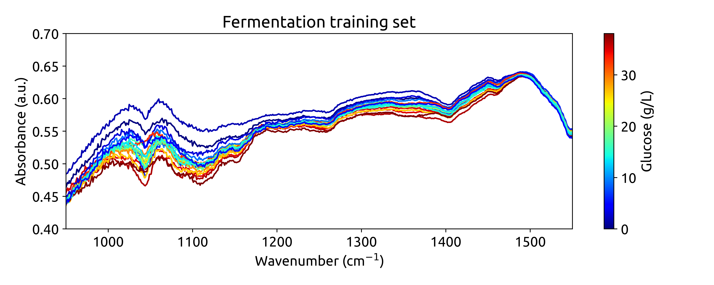

# __Training a regression model__

## __Introduction__
Welcome to the world of spectroscopic data analysis, where we provide you with a unique insight into lignocellulosic ethanol fermentation in real-time. Our dataset comprises spectra obtained through attenuated total reflectance, mid-infrared (ATR-MIR) spectroscopy, combined with high-performance liquid chromatography (HPLC) reference data to ensure precision and accuracy.

Within this project, you'll find two vital datasets:

- __Training Dataset:__ This extensive resource includes both spectral data and corresponding HPLC measurements, serving as the foundation of our analysis.

- __Testing Dataset:__ Immerse yourself in the fermentation process through a time series of real-time spectra. For a comprehensive view, we've also included off-line HPLC measurements.

For a deeper understanding of these datasets and their transformation of raw data into actionable insights, please refer to our comprehensive article: "Transforming Data to Information: A Parallel Hybrid Model for Real-Time State Estimation in Lignocellulosic Ethanol Fermentation." It's a journey into the world of data analysis, offering real-world applications.

{: .note }
> This is a step by step guide, that you should be able to run on your own computer. Just remember to install the ```chemotools``` package first using ```pip install chemotools```.

### __Loading the training dataset__
The Fermentation dataset is a valuable resource for investigating lignocellulosic ethanol fermentation. You can access it through the chemotools.datasets module using the ```load_fermentation_train()``` function:

```python
from chemotools.datasets import load_fermentation_train

spectra, hplc = load_fermentation_train()
```

The ```load_fermentation_train()``` function returns two ```pandas.DataFrame```:

- ```spectra```: This dataset contains spectral data, with columns representing wavenumbers and rows representing samples.

- ```hplc```: AHere, you'll find HPLC measurements, specifically glucose concentrations (in g/L), stored in a single column labeled ```glucose```.

### __Exploring the training dataset__

Before diving into data modeling, it's essential to get familiar with your data. Start by answering basic questions: _How many samples are there?_, and _how many wavenumbers are available?_

```python
print(f"Number of samples: {spectra.shape[0]}")
print(f"Number of wavenumbers: {spectra.shape[1]}")
```
This should return the following output:

```
Number of samples: 21
Number of wavenumbers: 1047
```

Now that you have the basics down, let's take a closer look at the data.

For the spectral data, you can use the ```pandas.DataFrame.head()``` method to examine the first 5 rows:

```python
spectra.head()
```

For brevity, we won't display the entire table here, but you'll notice that each column corresponds to a wavenumber, and each row represents a sample.

Turning to the HPLC data, the ```pandas.DataFrame.describe()``` method provides a summary of the glucose column:

```python
hplc.describe()
```

This summary offers insights into the distribution of glucose concentrations. With this practical knowledge, you're ready to embark on your data exploration journey.

|           | Glucose      |
|-----------|--------------|
| Count     | 21.000000    |
| Mean      | 19.063895    |
| Std       | 12.431570    |
| Min       | 0.000000     |
| 25%       | 9.057189     |
| 50%       | 18.395220    |
| 75%       | 29.135105    |
| Max       | 38.053004    |


### __Visualizing the training dataset__

To better understand our dataset, we employ visualization. We will generate a graphical representation of the train dataset, with each spectrum color-coded to reflect its associated glucose concentration. This visual approach provides a didactic means to grasp the dataset's nuances, offering insights into chemical variations among samples. To do so, we'll use the ```matplotlib.pyplot``` module:


```python
import matplotlib.pyplot as plt
from matplotlib.colors import Normalize

# Define a colormap
cmap = plt.get_cmap("jet")

# Define a normalization function to scale glucose concentrations between 0 and 1
norm = Normalize(vmin=hplc.glucose.min(), vmax=hplc.glucose.max())
colors = [cmap(normalize(value)) for value in hplc['glucose']]

# Plot the spectra
fig, ax = plt.subplots(figsize=(10, 4))
for i, row in enumerate(spectra.iterrows()):
    ax.plot(row[1], color=colors[i])

# Add a colorbar
sm = plt.cm.ScalarMappable(cmap=cmap, norm=normalize)
sm.set_array([])
fig.colorbar(sm, ax=ax, label='Glucose (g/L)')

# Add labels
ax.set_xlabel('Wavenumber (cm$^{-1}$)')
ax.set_ylabel('Absorbance (a.u.)')
ax.set_title('Fermentation training set')

plt.show()
```

This should result in the following plot:


Ok, these are not very beautiful spectra. This is because they are recorded over a long wavenumber range, where there is a large section withoug chemical information. Let's zoom in on the region between 950 and 1550 cm$^{-1}$, where we can see some interesting features:

