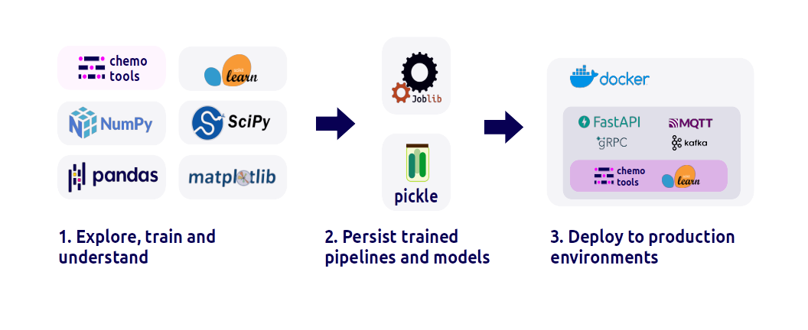

[](https://pypi.org/project/chemotools)
[](https://pypi.org/project/chemotools)
[](https://github.com/paucablop/chemotools/blob/main/LICENSE)
[](https://codecov.io/github/paucablop/chemotools)
[](https://pepy.tech/project/chemotools)

scikit-learn 
{: .label .label-yellow } 
chemometrics 
{: .label .label-yellow } 
spectroscopy 
{: .label .label-yellow } 
machine learning 
{: .label .label-yellow } 
data science 
{: .label .label-yellow } 


[Checkout in Github](https://github.com/paucablop/chemotools){: .btn .btn-blue }
[Read the Docs](https://paucablop.github.io/chemotools/docs/){: .btn .btn-blue }
[Install from PyPI](https://pypi.org/project/chemotools/){: .btn .btn-blue }
[Get started](https://paucablop.github.io/chemotools/get-started/){: .btn .btn-blue }

# __Welcome to chemotools__

This project provides a toolkit for spectral preprocessing techniques integrated with the widely popular ```scikit-learn``` API and the rest of the Python machine learning environment. The goal of the project is to provide a comprehensive and user-friendly package to standardize the development and deployment of chemometric models. The project intends to enable users to easily build and deploy machine learning and chemometric models on top of preprocessed data, making it possible to identify patterns and make predictions with greater accuracy.



## __1. Explore, model and understand__
```chemotools``` provides a tool-kit to integrate chemometric techniques with the rest of the Python machine learning environment. Explore your spectral data, build and train chemometric models, and understand the results. Use ```chemotools``` to preprocess your data and ```scikit-learn``` to build and train your models. 


## __2. Persist your trained models__
Easily and efficiently reuse your trained machine learning models across different projects without the need for time-consuming retraining. ```chemotools``` offers seamless persistence of models using common formats such as ```pickle``` or ```joblib```, allowing you to easily reload and deploy them in a variety of settings.

## __3. Deploy your models__
After training a machine learning model using ```scikit-learn``` and ```chemotools```, the next step is to deploy it to a production environment. Create an API using a your favorite framework. The API can receive input data and return predictions from the trained model. Once the API is built, it can be containerized using Docker, which provides an isolated environment to run the API. Creating a Docker image enables easy distribution and deployment of the model to any environment that supports Docker. By deploying the models through an API and Docker, organizations can scale the model's usage, monitor its performance, and quickly update or roll back the model when needed.
